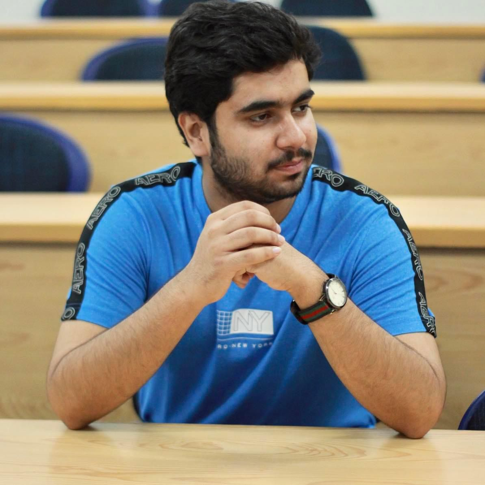

<!DOCTYPE html>
<html lang="en">
<head>
    <meta charset="UTF-8">
    <meta name="viewport" content="width=device-width, initial-scale=1.0">
    <title>cv</title>
    <link rel="stylesheet" href="https://cdnjs.cloudflare.com/ajax/libs/font-awesome/4.7.0/css/font-awesome.css" integrity="sha512-5A8nwdMOWrSz20fDsjczgUidUBR8liPYU+WymTZP1lmY9G6Oc7HlZv156XqnsgNUzTyMefFTcsFH/tnJE/+xBg==" crossorigin="anonymous" referrerpolicy="no-referrer" />
    <link rel="stylesheet" type="text/css" href="style.css">
    

</head>

<body>

    

        

            

                

                    
                

                <h2>Muhammad muzammil Web Devoloper</h2>
            

            

                <h3 class="title">Contact Info</h3>
                <ul>
                    <li>
                        <i class="fa fa-phone" aria-hidden="true"></i>
                        03144077222
                    </li>
                    <li>
                        <i class="fa fa-envelope" aria-hidden="true"></i>
                        muzammilnaveed41@gmail.com
                    </li>
                    <li>
                        <i class="fa fa-globe" aria-hidden="true"></i>
                        
                        www.muzammil.com
                    </li>
                    <li>
                        <i class="fa fa-linkedin" aria-hidden="true"></i>
                        
                        www.linkdin.com
                    </li>
                    <li>
                        <i class="fa fa-map-marker" aria-hidden="true"></i>
                        
                        karachi,Sindh Pakistan
                    </li>
                </ul>
            

            

                <h3 class="title">Education</h3>
                <ul>
                    <li>
                        <h5>2020-2024</h5>
                        <h4>bachelor in software engineering</h4>
                        <h4>Iqra University Main Campus</h4>
                    </li>

                    <li>
                        <h5>2018</h5>
                        <h4>Matriculation </h4>
                        <h4>The City School</h4>
                    </li>

                    <li>
                        <h5>2020</h5>
                        <h4>Intermediate</h4>
                        <h4>Pak-Turk Maarif International School And Colleges</h4>
                    </li>
                    
                </ul>
            

        

        

            

                <h2 class="title2">Profile</h2>
                
hello

            

            

                <h2 class="title2">Experience</h2>
                

                    

                        <h5>2024-Present</h5>
                        <h5>Company name</h5>
                    

                    

                       <h4>Web developer</h4>
                       
write description here

                    

                

            

            

                <h2 class="title2">Professional Skills</h2>
                

                    <h4>Html</h4>
                    

                        

                    

                    
                    

                

                

                    <h4>Css</h4>
                    

                        

                    

                

                

                    <h4>Html</h4>
                    

                        

                    

                

                

                    <h4>JavaScript</h4>
                    

                        

                    

                

            

            

                <h2 class="title2">Interest</h2>
                <ul>
                    <li><i class="fa fa-gamepad" aria-hidden="true"></i>Gaming</li>
                    <li><i class="fa fa-futbol-o" aria-hidden="true"></i>Cricket</li>
                    <li><i class="fa fa-book" aria-hidden="true"></i>Reading</li>
                    <li><i class="fa fa-film" aria-hidden="true"></i>Movies</li>
                </ul>
            

        

    

    
</body>
</html>